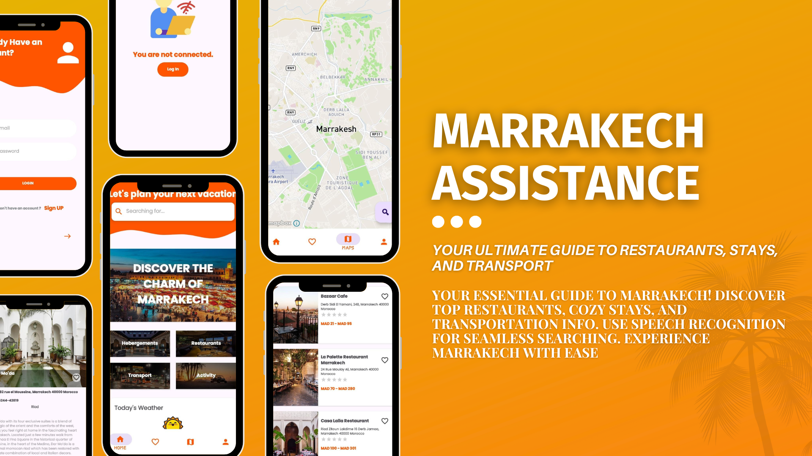

# Marrakech Assistance App

## Overview

Marrakech Assistance is your all-in-one guide to navigating the enchanting city of Marrakech. Whether you're a local resident or a curious traveler, our app provides essential information about restaurants, accommodations, transportation, and more to enhance your experience in Marrakech.


## Features

 * Discover Restaurants: Explore a curated list of restaurants offering authentic Moroccan cuisine and international flavors.
 * Find Accommodations: Browse through a variety of accommodations, from traditional riads to modern hotels, to suit your stay preferences.
 * Navigate with Ease: Get detailed information about transportation options, including public transit, taxis, and car rentals, making it easier to move around the city.
 * Speech Recognition: Use speech recognition technology for seamless and hands-free searching of places and attractions.

## Quick Start
1. Clone the Repository: Begin by cloning this repository to your local machine.

```bash
git clone git@github.com:same-ou/marrakech-assistance.git
```
2. Install Android Studio: If you haven't already, download and install Android Studio from [here](https://developer.android.com/studio)
3. Install Python:
    * Download and install Python from the [official Python website](https://www.python.org/downloads/).
4. Open the Project in Android Studio:
    * Launch Android Studio and open the cloned project (marrakech-assistance) from your file system.
    * Ensure that Chaquopy is configured correctly in your Android Studio project settings.
5. Run the App: Connect your Android device or use an emulator, then build and run the Marrakech Assistance app from Android Studio.
6. Explore Categories: Once the app is running on your device, you can start exploring categories like restaurants, accommodations, and transport within the app.

Happy coding! 🚀✨


